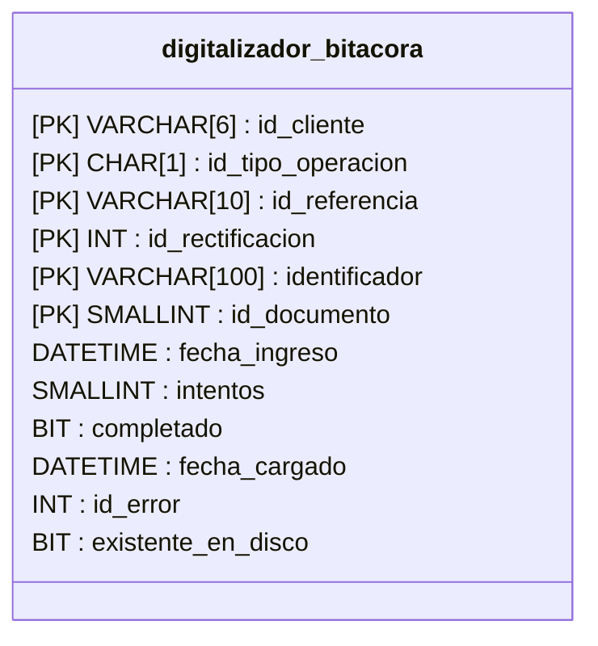

# Bitácora

La tabla digitalizador_bitacora es el origen de las referencias que el digitalizador considerará para el proceso de digitalización.

La estructura es la siguiente:

### Campos oc_pedimento_pago
La bitacora se relaciona con oc_pedimento_pago por medio de los siguientes campos: id_cliente, id_tipo_operacion, id_referencia e id_rectificacion.
Dicha relación servirá para relacionar los documentos digitalizados a ese pedimento en portal.

### Campos del identificador

El valor del identificador puede variar dependiendo del id_documento establecido en el registro de la bitacora.

|Id|Documento|Identificador|
|-|-|-|
|77| Cove XML | COVE |
|76|Pedimento completo| Pedimento#Aduana#Patente |
|73|Acuse EDocument PDF | EDocument |
|72| Acuse Cove PDF | Cove |
|25| Cove PDF | Cove |

:::tip recomendación
Para el manejo de identificadores separados por '#' se puede hacer uso de la funcion obtener_parametro, dando como argumentos el identificador y el numero de parametro que se desea obtener.
:::

### Campos de estatus

- **completado** se marcara como 1 si la referencia se digitalizó completamente.
- **intentos** indica cuantas veces la referencia ha sido considerada por el digitalizador para intentar generar dicho documento, en caso de que los intentos sean 7 ya no volverá a ser considerada la referencia por el digitalizador.
- **id_error** es el identificador de algun error guardado en la tabla digitalizador_errores para saber específicamente por qué es que el documento no pudo ser digitalizado. 
- **fecha_ingreso** indica cuando fue que la referencia se inserto en bitacora.
- **fecha_cargado** indica la fecha en cuando el documento se digitalizo correctamente.
- **existente_en_disco** indica si el archivo digitalizado ya existia en disco y por lo tanto tuvo que sobrescribir dicho documento.

## DigArchivo

Para saber si un archivo fue cargado por el digitalizador basta con revisar si la columna digitalizador tiene un valor de 1 (dig_archivo.digitalizador = 1).

## Regenerar documento

Si se desea volver a considerar una referencia de bitacora que ya fue generada o tuvo algun tipo de problema para ser digitalizada:
Elimine la referencia de bitacora y vuelva a insertarla o actualice los siguientes valores del registro ya existente:
- intentos=0
- cargado=0
- fecha_cargado=NULL
- id_error=NULL
- existente_en_disco=NULL
