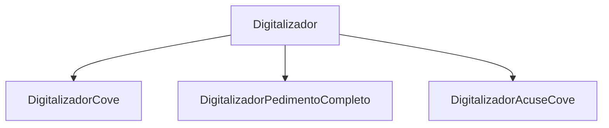
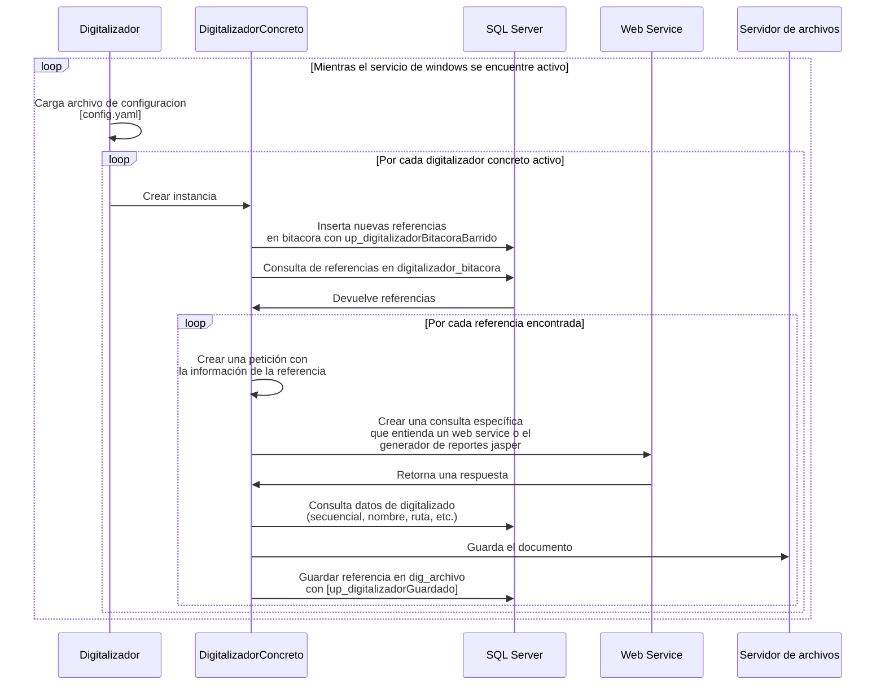
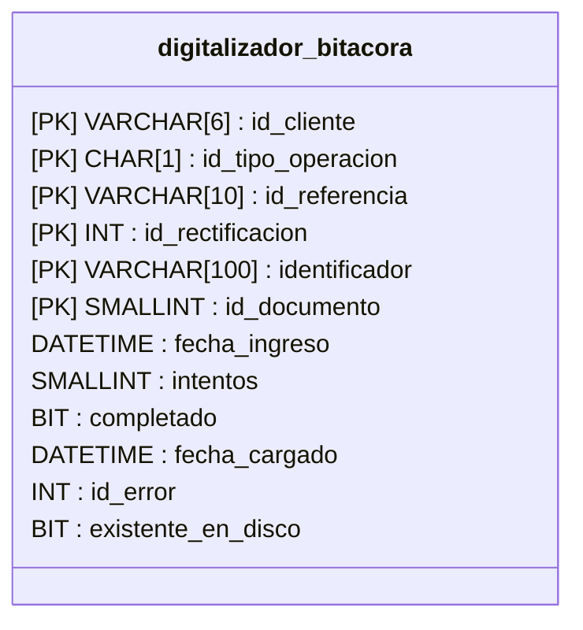

# 🗃 Digitalizador

:::info Enlace a repositorio
[Ir al repositorio en Github (Es necesario tener permisos)](https://github.com/aduasis-logistica/app-digitalizador)
:::

<details>
  <summary>**🧪 Stack tecnológico**</summary>
  
  Lenguajes de programación:
  - Python 3.8.2

  IDEs/Editores recomendados:
  - Pycharm community Edition
  - Visualstudio code

  ¿Qué necesito saber?
  - La librería para hacer peticiones SOAP es Zeep
  - La librería para hacer pruebas es Pytest
  - La lbireriía para guardar logs es loguru

</details>

<center>
    
</center>

## ℹ️ ¿Qué es?


Entiendase como **digitalizar** al proceso por el cual tiene que pasar un documento para ser generado y a 
**digitalizador** como al conjunto de softwares, algoritmos o tecnologías utilizadas para lograr el proceso de digitalizado. 

:::caution AVISO
La documentación descrita a continuación hace referencia al nuevo digitalizador y no al digitalizador desarrollado en power builder.
:::

Por cada documento existe un **digitalizador concreto** encargado del proceso para generarlo.



El digitalizador tiene dos formas de generar documentos:
- A partir del consumo de un web service independiente a Aduasis (VUCEM).
- A partir de un reporte propio de Aduasis tipo Jasper consultando un API hecha por Aduasis.


### 📃 Funcionamiento

A grandes rasgos, el digitalizador es un proceso ejecutado en el background en forma de servicio
de windows, el cual es apoyado de un archivo de configuración tipo YAML en donde se específican
parametros como la cadena de conexión a la base de datos, parámetros para la consulta
a los web services, opción para apagar y encender digitalizadores y opciones para el guardado
de logs. 

El diagrama de secuencia sería el siguiente:


### 📃 Bitácora

La tabla digitalizador_bitacora es el origen de las referencias que el digitalizador considerará para el proceso de digitalización.

La estructura es la siguiente:


#### Campos oc_pedimento_pago
La bitacora se relaciona con oc_pedimento_pago por medio de los siguientes campos: id_cliente, id_tipo_operacion, id_referencia e id_rectificacion.
Dicha relación servirá para relacionar los documentos digitalizados a ese pedimento en portal.

#### Campos del identificador

El valor del identificador puede variar dependiendo del id_documento establecido en el registro de la bitacora.

|Id|Documento|Identificador|
|-|-|-|
|77| Cove XML | COVE |
|76|Pedimento completo| Pedimento#Aduana#Patente |
|73|Acuse EDocument PDF | EDocument |
|72| Acuse Cove PDF | Cove |
|25| Cove PDF | Cove |

:::tip recomendación
Para el manejo de identificadores separados por '#' se puede hacer uso de la funcion obtener_parametro, dando como argumentos el identificador y el numero de parametro que se desea obtener.
:::

#### Campos de estatus

- **completado** se marcara como 1 si la referencia se digitalizó completamente.
- **intentos** indica cuantas veces la referencia ha sido considerada por el digitalizador para intentar generar dicho documento, en caso de que los intentos sean 7 ya no volverá a ser considerada la referencia por el digitalizador.
- **id_error** es el identificador de algun error guardado en la tabla digitalizador_errores para saber específicamente por qué es que el documento no pudo ser digitalizado. 
- **fecha_ingreso** indica cuando fue que la referencia se inserto en bitacora.
- **fecha_cargado** indica la fecha en cuando el documento se digitalizo correctamente.
- **existente_en_disco** indica si el archivo digitalizado ya existia en disco y por lo tanto tuvo que sobrescribir dicho documento.

### 📃 DigArchivo

Para saber si un archivo fue cargado por el digitalizador basta con revisar si la columna digitalizador tiene un valor de 1 (dig_archivo.digitalizador = 1).

### 📃 Regenerar documento

Si se desea volver a considerar una referencia de bitacora que ya fue generada o tuvo algun tipo de problema para ser digitalizada:
Elimine la referencia de bitacora y vuelva a insertarla o actualice los siguientes valores del registro ya existente:
- intentos=0
- cargado=0
- fecha_cargado=NULL
- id_error=NULL
- existente_en_disco=NULL

## 💿 Instalación

La versión de python utilizada para esta aplicación es Python 3.8.2. 

[Descarga Python 3.8.2](https://www.python.org/downloads/release/python-382/)

Se recomienda el uso del IDE de Pycharm Community Edition para un mejor manejo del código fuente de la aplicación.

[Enlace de descarga Pycharm Community Edition.](https://www.jetbrains.com/pycharm/download/other.html)

### 📃 Manejo del entorno virtual en python

Como buena práctica y para separar el proyecto del digitalizador de otros proyectos hechos en python dentro de la máquina que estás utilizando
se recomienda el uso de entornos virtuales.

Para crear un entorno virtual primero abre una consola de windows y dirigete a la ubicación de la ruta raíz del proyecto:
```commandline
cd  C:\proyectos\app-digitalizador\
```
Posteriormente instala la utilidad para crear entornos virtuales en python
```commandline
pip install virtualenv
```

Posteriormente ejecuta el siguiente comando para crear un entorno virtual
```commandline
virtualenv .env
```
Ahora es necesario que actives el entorno virtual, basta con ejecutar el siguiente comando en la consola (dentro del path de la ruta raíz del proyecto)
```commandline
.env\Scripts\activate
```

Por último ejecuta el sigueinte comando para bajar todas las librerias utilizadas en el proyecto dentro de tu entorno virtual:
```commandline
pip install -r requirements.txt
```

Una vez realizados estos pasos solo serciorate de que cada vez que abras el proyecto en Pycharm te reconozca el entorno virtual que acabas de crear.
Vease el sigueinte tutorial: [Configure a virtual environment](https://www.jetbrains.com/help/pycharm/creating-virtual-environment.html#env-requirements)

## 🔨 Compilación

Para crear el archivo binario de la aplicación basta con ejecutar el sigueinte comando en consola:
```commandline
.env\\Scripts\\pyinstaller.exe  -F --hidden-import=win32timezone --icon=icon.ico setup.py --clean --version-file=versionfile.txt
```

## 🚀 Despliegue
En caso de que el digitalizador necesite digitalizar documentos provenientes de un reporte jasper vease la siguiente guía para instalar el api de reportes jasper.
[API Jaspers](/docs/documentacion/productos/api-reportes-jasper)

### 📃 Habilitar Bouncy Castle para firmado de documentos

Instalar la versión de .NET Framework 4.7.2 para el firmado digital de dodas por medio de bouncy castle https://dotnet.microsoft.com/en-us/download/dotnet-framework/net472.

**Habilitar DLLs (En caso de aplicar)** 

Hay veces en la que la version de windows requiere que se habiliten los dlls de forma manual, si es el caso en el que en el servidor en donde se esta instalando el digitalizador no tiene esta opción, favor de ignorar este paso.

Dirijase a la carpeta en donde se encuentra los archivos dlls (Ruta raiz del digitalizador / dlls / aduasis-tools) y siga los siguientes pasos en cada uno de los dlls existentes.

Click derecho sobre el dll y dar en propiedades.


Damos click la casilla unblock y damos clic en aplicar.


Repetir el paso con cada uno de los Dlls existentes en la carpeta.

### 📃 Variables de entorno

Es necesario crear las siguientes variables de entorno:

- aduasis_digitalizador (Ruta raíz en donde se encuentra el digitalizador)
    
    
    
- JWT_KEY (Key para la generacion de JWT para consultar a la api de jaspers, si ya existia no crear otra)

### 📃 Archivo de configuración

El archivo de configuración es config.yaml y se debe encontrar en la ruta raíz del digitalizador establecida en la variable de entorno.

El archivo en cuestión es un archivo de configuración en formato YAML, en donde el contenido es el siguiente:

```yaml
connection:
  driver: "SQL Server"
  server: "servidor"
  user: "usuario"
  password: "password"
  database: "aduasism3"

digitalizadores_vucem:
  acuse_cove_pdf: off
  acuse_edocument_pdf:
    estatus: off
    unir_con_edocument: off
  cove_respuesta_xml: off
  cove_xml:
    estatus: off
    desencadenador: off
  cove_pdf: off
  doda_alta_consulta_xml: off
  doda_estatus_consulta_xml: off
  doda_estatus_respuesta_xml: off
  edocument_consulta_xml: off
  edocument_no_certifica_pdf: off
  edocument_no_certifica_xml: off
  edocument_respuesta_xml: off
  pedimento_completo_xml:
    estatus: off
    desencadenador: off
  pedimento_partida_xml: off

digitalizadores_generados:
  archivo_pago_electronico: off
  archivo_respuesta_pago_electronico: off
  archivo_respuesta_validacion_shcp: off
  archivo_validacion_shcp: off
  numeros_parte_oc_xml: off

digitalizadores_jasper:
  acuse_cove_pdf: off
  acuse_edocument_pdf: off
  anexo_hoja_calculo_pdf: off
  cove_pdf: off
  doda_pdf: off
  hoja_calculo_pdf: off
  manifestacion_valor_pdf: off
  nota_revision_pdf: off
  orden_carga_pdf: off
  pedimento_completo_pdf: off
  pedimento_informativo_pdf: off
  pedimento_simplificado_pdf: off
  remesa_pdf: off
  series_cove_xls: off
 
api_jasper_endpoint: "http://localhost:8090"
ruta_imagenes_jasper: "C:\\SISNL\\TPLaser\\Reportes\\media\\"
```

**Nodo de conexión a la base de datos**

Aquí se establecerá la información necesaria para que el digitalizador se conecte a la base de datos de aduasism3:

```yaml
connection:
  driver: "SQL Server"
  server: "servidor"
  user: "usuario"
  password: "password"
  database: "aduasism3"
```

Para conocer el driver es necesario ver el siguiente tutorial: https://documentation.help/howtosql/ht_cliepcc_4qpl.htm

**Nodo de encendido y apagado de digitalizadores**

Todos los nodos encontrados dentro de digitalizadores_vucem, digitalizadores_generados y digitalizadores_jasper son banderas para apagar o encender los digitalizadores.

NOTA: Abran casos en donde el digitalizador en concreto tenga configuraciones adicionales a parte de su estatus, un ejemplo es acuse_edocument_pdf que permite unir este documento con otro ya existente.

```yaml
digitalizadores_vucem:
  acuse_edocument_pdf:
    estatus: on
    unir_con_edocument: on
```

**Configuración a la API Jasper**

Es necesario configurar el endpoint en el que se va a tomar en cuenta para la generación de reportes y de acuerdo al tutorial de instalación de la jasper api es necesario tomar el endpoint del api REST, ejemplo:

```yaml
api_jasper_endpoint: "http://localhost:8090"
```

Por otra parte hay reportes que necesitan la ruta en donde se encuentran las imagenes de los reportes del digitalizador, por lo que es necesario establecerla explicitamente.

```yaml
ruta_imagenes_jasper: "C:\\SISNL\\TPLaser\\Reportes\\media\\"
```

### 📃 Instalación de acuerdo a modo

#### Consola

Haga click derecho sobre el binario setup.exe y cree un acceso directo.


Haga click derecho sobre el acceso directo y de clic en propiedades.


Asegurese que en el campo target al final agregue un espacio y el parametro console, tal que quede de la siguiente forma:


Por último abra el acceso directo y compruebe que se encuentre el digitalizador funcionando (vease la consola y la carpeta logs que se encuentra en la carpeta raíz del digtializador): 


#### Windows service

Abra una consola en modo administrador, dirijase a la carpeta raíz en donde se encuentra el digitalizador y ejecute el comando setup install, tal que así:


Una vez instalado se verá la frase Service installed, lo que queire decir que ya podrá visualizar el servicio en windows.


Es aquí en donde podrá configurar el inicio de la aplicación, ya sea manual o de inicio automático.

Para ver el comportamiendo del digitalizador basese en la carpeta de logs de la ruta raíz del digitalizador.
