# 💻 Portal SPA

:::info Enlace a repositorio
[Ir al repositorio en Github (Es necesario tener permisos)](https://github.com/aduasis-logistica/app-portal)
:::

<details>
  <summary>**🧪 Stack tecnológico**</summary>
  
  Lenguajes de programación:
  - Typescript

  IDEs/Editores recomendados:
  - Visualstudio code
  - Webstorm

  ¿Qué necesito saber?
  - Angular
  - Módulo para formularios reactivos en Angular.
  - RXJS Para el manejo de eventos asíncronos en flujo de datos.
  - OpenAPI Generator.
  - NPM.
  - Docker.

</details>

:::danger Pendientes
- Restringir acceso de páginas módulos, si bien no aparecen en el menú los modulos de acuerdo a lo que esta configurado en webmodulo si el usuario tiene el url directo para entrar a la página podrá hacerlo. Por lo tanto, es necesario aplicar [Guards](https://binarycoffee.dev/post/guards-en-angular-como-funcionan) al proyecto.
:::


## ℹ️ ¿Qué es?

El surgimiento de Portal SPA responde a la imperante necesidad de actualizar las tecnologías empleadas en un proyecto preexistente dedicado a la gestión de operaciones aduaneras. En este contexto, se busca efectuar una transición desde una arquitectura monolítica hacia un enfoque basado en microservicios. El propósito central de esta iniciativa es lograr un desacoplamiento completo entre la interfaz visual y la lógica de la aplicación.

Portal SPA representa la faceta del proyecto centrada en la experiencia visual del usuario con el sistema. Esta transformación permitirá una mayor flexibilidad, escalabilidad y mantenibilidad, mejorando así la eficiencia global del sistema de gestión de operaciones aduaneras.

### Infraestructura


### Factura light - Tablas

```mermaid
erDiagram 
    fpedimento ||--|{ frel_pedimento_factura: "1..*"
    fpedimento ||--|{ frel_partidas_factura_pedimento: "1..*"

  fpedimento{
        VARCHAR(10) id_referencia PK
        NUMERIC(1_0) id_rectificacion PK 
     }

     frel_pedimento_factura{
        VARCHAR(10) id_referencia PK,FK 
        NUMERIC(1_0) id_rectificacion PK,FK
        VARCHAR(36) id_factura PK
        VARCHAR(6) id_proveedor PK
        DATETIME fecha_factura PK "¿¿PK??"
        NUMERIC(18_0) consecutivo PK
     }

    frel_partidas_factura_pedimento{
        VARCHAR(10) id_referencia PK "FK2"
        DECIMAL(1_0) id_rectificacion PK
        VARCHAR(36) id_factura PK "FK1"
        VARCHAR(15) id_pack_list PK "FK1"
        DECIMAL(4_0) num_detalle PK "FK1"
        VARCHAR(6) id_cliente "FK1"
        VARCHAR(6) id_proveedor "FK1"
    }

```




## 💿 Instalación
1. Descargar Node.js: [Clic aqui para descargar Node.js 20.10.0.](https://nodejs.org/en/download/)

2. Descargar editor de código Visual Studio Code: [Clic aquí para descargar Visual Studio Code.](https://code.visualstudio.com/)

3. Instalar Angular CLI: El proyecto esta basado en el framework de Angular en su version 17.0.9, por lo que se tendrá que ejecutar el siguiente comando en consola.

```cmd
npm -g install @angular/cli@17.0.9

```

Ahora dirijase a la carpeta raíz del proyecto desde la terminal y ejecute el comando de instalación de paquetes

```cmd
cd C:\applicaciones\portal-spa
npm install
```

Por último arranque el proyecto desde la terminal

```cmd
ng serve
```

#### Depurar aplicación

Basta con correr la aplicación desde la terminal de visual studio code

```cmd
ng serve
```

Y presionar sobre el botón de depuración seleccionando 'Launch Chrome' en visual studio code.


### Librerías para consultar APIs / OpenAPI Generator

OpenAPI es una especificación para describir APIs REST. Permite definir, en un formato estandarizado (normalmente en JSON o YAML), todos los detalles de una API, como sus endpoints, métodos, parámetros, respuestas y esquemas de datos. Es útil para documentar, compartir y consumir APIs de manera consistente.

OpenAPI Generator es una herramienta que utiliza una definición OpenAPI para generar automáticamente código. Esto incluye:

Clientes para consumir la API en diferentes lenguajes (Java, Python, etc.).
Servidores con la estructura básica de la API.
Documentación en varios formatos.
Facilita el desarrollo al reducir el trabajo manual en la creación de código relacionado con APIs.

[Proyecto OPEN API Generator Aduasis](https://github.com/aduasis-logistica/app-library-generation)


## 🔨 Compilación


Ejecute el siguiente comando en la terminal para compilar en un entorno de producción.

```cmd
ng build --configuration=production --base-href=/SPA/ 
```

:::info Uso de la bandera base href /SPA/
Esta solo es si la aplicación va a ser desplegada en una ruta distinta a la raíz del dominio.

Por ejemplo, es útil con Uber cuando ellos tienen como ruta raíz uberfreight.com/ a portal Aduanero java y en una ruta uberfreight.com/SPA/ tienen la aplicación SPA. Esto por medio del uso de un Reverse Proxy para mantener un dominio con distintas aplicaciones.
:::

## 🚀 Despliegue

Basta con copiar y pegar el compilado en una servidor web de contenido estático como puede ser IIS, sin embargo si se desea compartir el mismo enlace entre portal Java y portal SPA es necesario hacer una configuración por medio de un Reverse Proxy.

## Despliegue en IIS

Es necesario tener instalado las siguientes utilidades:

- [ARR Para reverse proxy](https://learn.microsoft.com/es-es/iis/extensions/url-rewrite-module/reverse-proxy-with-url-rewrite-v2-and-application-request-routing#prerequisites)
- [URL Rewrite](https://learn.microsoft.com/es-es/iis/extensions/url-rewrite-module/using-the-url-rewrite-module)

### IIS Webconfig para portal SPA

El archivo de configuración para desplegar la aplicación SPA en un servidor IIS es la siguiente:

```xml title="web.config"
<?xml version="1.0" encoding="UTF-8"?>
<configuration>
    <system.webServer>
        <rewrite>
        <rules>
            <rule name="redirect all requests" stopProcessing="true">
                <match url="^(.*)$" ignoreCase="false" />
                <conditions logicalGrouping="MatchAll">
                    <add input="{REQUEST_FILENAME}" matchType="IsFile" negate="true" pattern="" ignoreCase="false" />
                </conditions>
                <action type="Rewrite" url="index.html" appendQueryString="true" />
            </rule>
        </rules>
    </rewrite>
    </system.webServer>
</configuration>

```

### IIS Webconfig para Reverse Proxy

Ejemplo de configuracion de reverse proxy de diversas APIs en una arquitecrua de microservicios en el mismo servidor pero en distintos puertos.

```xml
<?xml version="1.0" encoding="UTF-8"?>
<configuration>
    <system.webServer>
    
        <rewrite>
            <rules >
                <rule name="Reverse Proxy to YMS" stopProcessing="true">
                    <match url="^factura-light/(.*)" />
                    
                    <conditions logicalGrouping="MatchAll">
                        <add input="{UNENCODED_URL}" pattern="^/factura-light/(.*)" />
                    </conditions>
                    
                    <action type="Rewrite" url="http://localhost:5025/{C:1}" />
                   
                </rule>
                 <rule name="Reverse Proxy to Reportes Jasper" stopProcessing="true">
                    <match url="^reportes-jasper/(.*)" />
                    <action type="Rewrite" url="http://AWADUSANDVU02:8080/{R:1}" />
                </rule>
                <rule name="Reverse Proxy to Seguridad Microservice" stopProcessing="true">
                    <match url="^seguridad/(.*)" />
                    <action type="Rewrite" url="http://AWADUSANDVU02:8060/{R:1}" /> 
                </rule>
                <rule name="Reverse Proxy to Catalogos Microservice" stopProcessing="true">
                    <match url="^catalogos/(.*)" />
                    <action type="Rewrite" url="http://AWADUSANDVU02:8061/{R:1}" />
                </rule>
                 <rule name="Reverse Proxy to Digitalizacion Microservice" stopProcessing="true">
                    <match url="^digitalizacion/(.*)" />
                    <action type="Rewrite" url="http://AWADUSANDVU02:8062/{R:1}" />
                </rule>
                 <rule name="Reverse Proxy to Clasificacion Microservice" stopProcessing="true">
                    <match url="^clasificacion/(.*)" />
                    <action type="Rewrite" url="http://AWADUSANDVU02:8063/{R:1}" />
                </rule>
                 <rule name="Reverse ProxyProxy to FacturaLight Microservice" stopProcessing="true">
                    <match url="^factura-light/(.*)" />
                    <action type="Rewrite" url="http://AWADUSANDVU02:8064/{R:1}" />
                </rule>  
            </rules>
        </rewrite>
        <httpProtocol>
          <customHeaders>

                <add name="X-Forwarded-Proto" value="http" />
                <add name="X-Forwarded-Port" value="80" />
            </customHeaders>
        </httpProtocol>
            <security>
               <!----> <requestFiltering allowDoubleEscaping="true" />
            </security>-->
    </system.webServer>
</configuration>

```