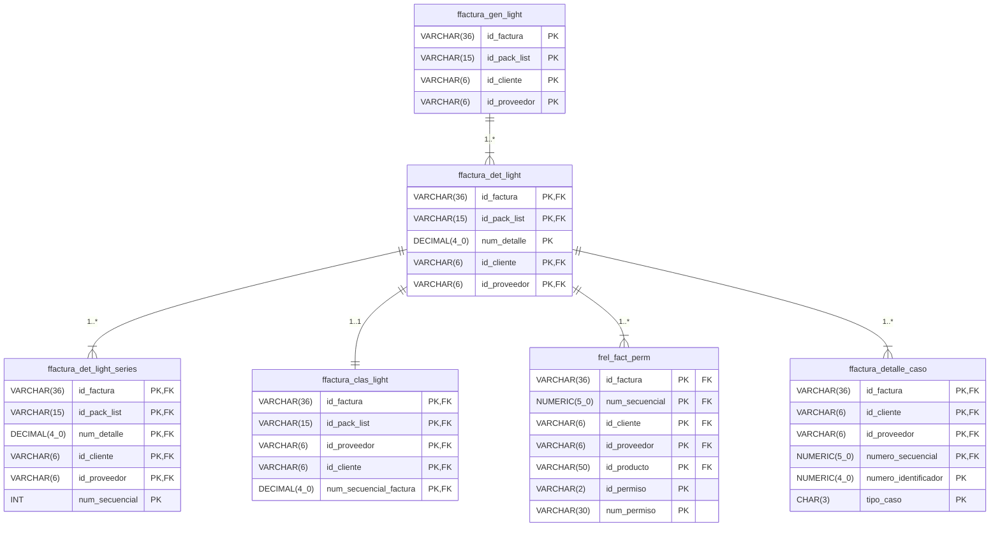
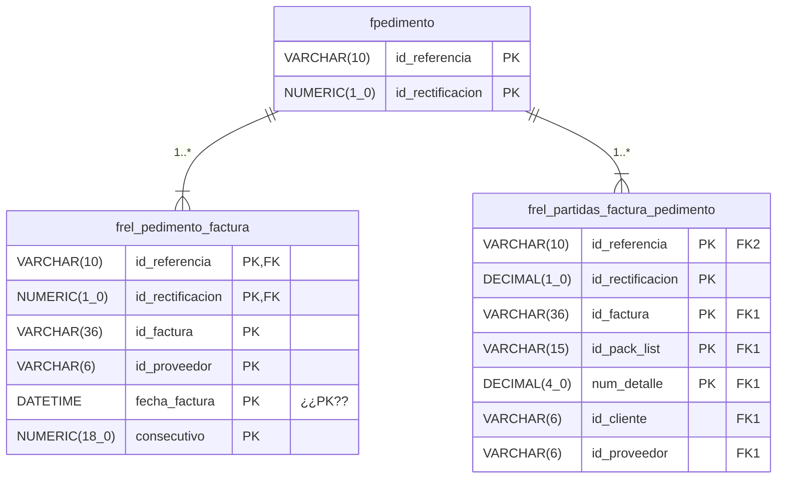

# Definición de datos 

# Relaciones de tablas Aduasis

```mermaid
erDiagram 
    ffactura_gen_light ||--|{  ffactura_det_light : "1..*"
    ffactura_det_light ||--|{ ffactura_det_light_series : "1..*"
    ffactura_det_light ||--|| ffactura_clas_light: "1..1"
    ffactura_det_light ||--|{ frel_fact_perm : "1..*" 
    ffactura_det_light ||--|{ ffactura_detalle_caso : "1..*" 
    
  

    ffactura_gen_light{
        VARCHAR(36) id_factura PK
        VARCHAR(15) id_pack_list PK 
        VARCHAR(6) id_cliente PK
        VARCHAR(6) id_proveedor PK
    }

    ffactura_det_light{
        VARCHAR(36) id_factura PK,FK
        VARCHAR(15) id_pack_list PK,FK
        DECIMAL(4_0) num_detalle PK
        VARCHAR(6) id_cliente PK,FK
        VARCHAR(6) id_proveedor PK,FK
    }
    
    ffactura_det_light_series{
        VARCHAR(36) id_factura PK,FK
        VARCHAR(15) id_pack_list PK,FK
        DECIMAL(4_0) num_detalle PK,FK
        VARCHAR(6) id_cliente PK,FK
        VARCHAR(6) id_proveedor PK,FK
        INT num_secuencial PK
    }
    
    ffactura_clas_light{
        VARCHAR(36) id_factura PK,FK
        VARCHAR(15) id_pack_list PK,FK
        VARCHAR(6) id_proveedor PK,FK
        VARCHAR(6) id_cliente PK,FK
        DECIMAL(4_0) num_secuencial_factura PK, FK
     }

 
 
    frel_fact_perm{
        VARCHAR(36) id_factura PK "FK"
        NUMERIC(5_0) num_secuencial PK "FK"
        VARCHAR(6) id_cliente PK "FK"
        VARCHAR(6) id_proveedor PK "FK"
        VARCHAR(50) id_producto PK "FK"
        VARCHAR(2) id_permiso PK 
        VARCHAR(30) num_permiso PK
    }


    ffactura_detalle_caso{
        VARCHAR(36) id_factura PK,FK
        VARCHAR(6) id_cliente PK,FK
        VARCHAR(6) id_proveedor PK,FK
        NUMERIC(5_0) numero_secuencial PK,FK
        NUMERIC(4_0) numero_identificador PK
        CHAR(3) tipo_caso PK
    }


```

```mermaid
erDiagram 
    fpedimento ||--|{ frel_pedimento_factura: "1..*"
    fpedimento ||--|{ frel_partidas_factura_pedimento: "1..*"

  fpedimento{
        VARCHAR(10) id_referencia PK
        NUMERIC(1_0) id_rectificacion PK 
     }

     frel_pedimento_factura{
        VARCHAR(10) id_referencia PK,FK 
        NUMERIC(1_0) id_rectificacion PK,FK
        VARCHAR(36) id_factura PK
        VARCHAR(6) id_proveedor PK
        DATETIME fecha_factura PK "¿¿PK??"
        NUMERIC(18_0) consecutivo PK
     }

    frel_partidas_factura_pedimento{
        VARCHAR(10) id_referencia PK "FK2"
        DECIMAL(1_0) id_rectificacion PK
        VARCHAR(36) id_factura PK "FK1"
        VARCHAR(15) id_pack_list PK "FK1"
        DECIMAL(4_0) num_detalle PK "FK1"
        VARCHAR(6) id_cliente "FK1"
        VARCHAR(6) id_proveedor "FK1"
    }

```
