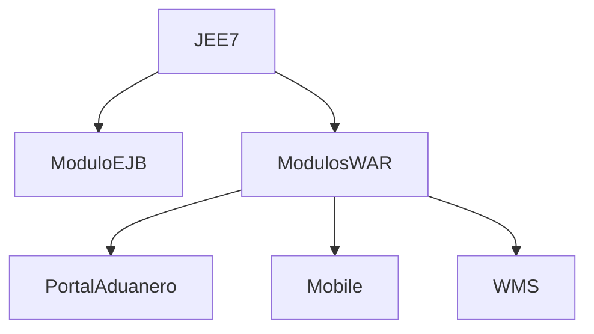
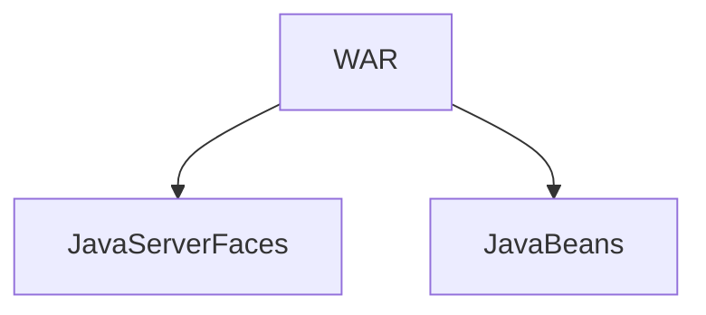

# Arquitectura

El proyecto de portal aduanero esta desarrollado bajo el estandar Java EE7 el cual es un conjunto de especificaciones que define la compañía de Oracle para el desarrollo de aplicaciones enterprise.

## Modulo EJB

Hace referencia al backend de una aplicación web, en donde dentro de este modulo se encuentran las siguientes definiciones:

### Entidades

Conjunto de clases para representar la capa de dominio en una aplicación.
Estas clases estan ligadas a una tabla de la base de datos y son utilizadas principalmente para trabajar con el framework de persistencia para hacer queries de manera más amigable por medio de la programación.

### Fachadas

Es un patrón de diseño para abstaer el proceso complejo en un sistema.

### Motores

Vease a un motor como una clase que implementa un método para que este sea ejecutado cada cierto tiempo durante el ciclo de vida de la aplicación.

## Modulo WAR

Hace referencia a todo lo que el frontend respecta en una aplicación web, es decir todo aquello que el usuario final puede visualizar.

