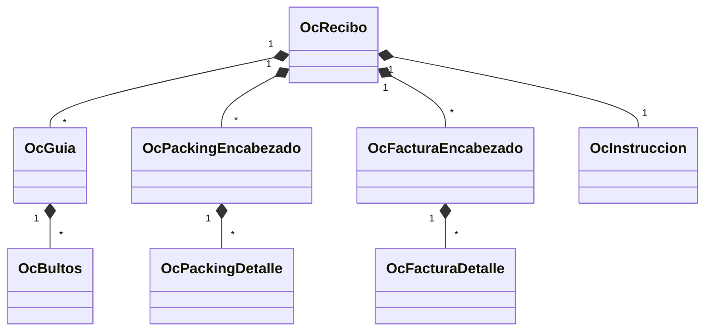
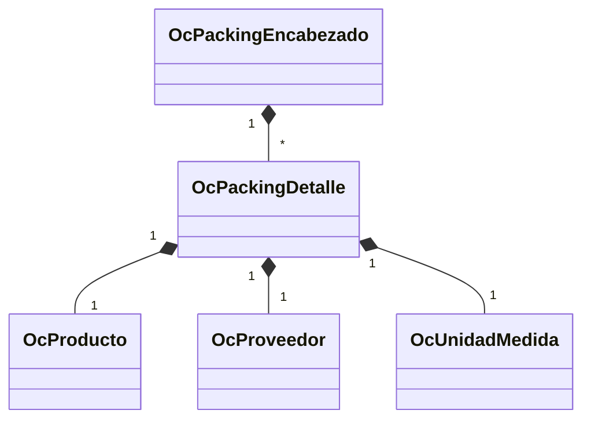
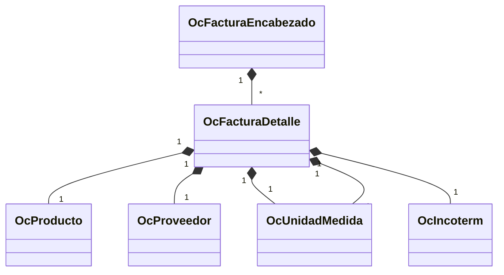
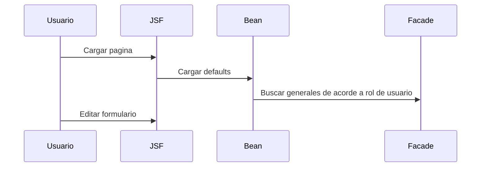
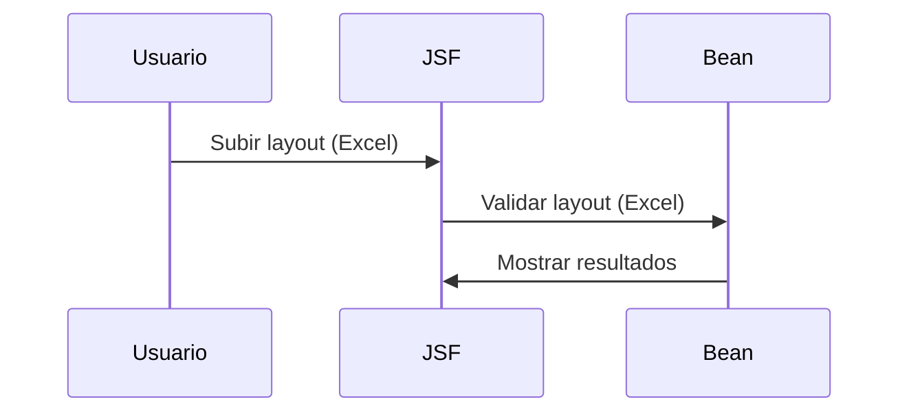

# Operaciones especiales

Operaciones especiales es un modulo el cual tiene como objetivo principal crear una operación desde recibo hasta consolidación por meido de un layout (excel) configurado por cliente.

## Entidades

### Packings

### Factura

## Instruccion

## Configuración

## Página de operaciones especiales

### Cargado de la pagina

## Cargado de layout (Excel)

