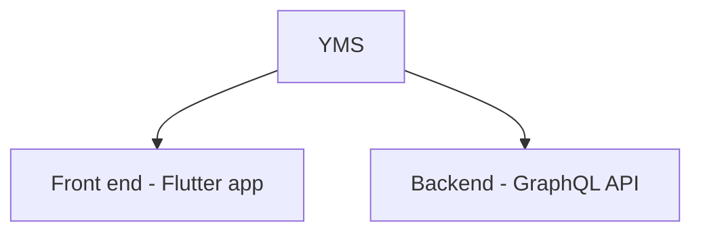

# Arquitectura de la aplicación

## Aplicaciones YMS

La aplicaciones se encuentra conformada de la siguiente manera:

**Front end:**

Entiendase como front end a la parte de la aplicación con la cual el usuario estará interactuando.

El front end se encuentra desarrollada en el lenguage de programación Dart y haciendo uso del Framework de Flutter para crear las interfaces gráficas.

**Back end:**

Entiendase como backend a la parte que se encarga de resolver toda la logica de negocio y sus implementaciones.

## Conociendo clean architecture

Para el desarrollo de la aplicación móvil se emplearon un conjunto de
herramientas, conceptos y buenas prácticas; esto con el objetivo de
obtener una aplicación de alta calidad y que sea escalable a largo plazo.
Arquitectura limpia
La arquitectura de software utilizada para desarrollar la aplicación fue la
arquitectura limpia propuesta por Robert C. Martin, la cual consiste en una
combinación de arquitecturas tales como la arquitectura hexagonal,
arquitectura de cebolla y la arquitectura de puertos con adaptadores.
La arquitectura limpia propone dividir el proyecto en capas, de tal forma
que se define una regla de dependencia en donde las capas externas
dependen de las capas internas, sin embargo, las capas internas no
conocen de las capas externas.
Ilustración 1 Regla de dependencia en una arquitectura limpia
La cantidad de capas en esta arquitectura puede variar de acuerdo a las
necesidades de la aplicación, en este caso fue suficiente definir tres.

**Capa de dominio:**

Es en donde se situarán todas las entidades correspondientes al sistema.

**Capa de aplicación:**

Capa en donde se encuentran las definiciones de la lógica del negocio,
pero no sus implementaciones.

**Capa de infraestructura:**

Aquí es en donde se llevan a cabo todas las implementaciones definidas
en la capa de aplicación haciendo uso de marcos de trabajo o tecnologías
que no tienen que ver directamente con la lógica del negocio y que
comúnmente se les suele denominar como los detalles.
Este tipo de arquitectura tiene como fin que el proyecto tenga una
escalabilidad adecuada, sea mucho más sencillo el aplicar un entorno de
pruebas automatizado y facilitar el trabajo en equipo.

## Seguridad

### Autenticación

El proceso de autenticación empieza con una solicitud que involucran las credenciales del usuario que están conformadas por un usuario o correo electrónico y una contraseña, las cuales son enviadas desde la aplicación móvil hacía el servidor remoto o bien la API, que es en donde se va a revisar que las credenciales sean correctas, para ello se hace un hash a la contraseña y se compara con la que se encuentra guardada en la base de datos, si existe un usuario con esas credenciales se procede a crear un token que permite saber el tiempo de vida que tiene la sesión y el rol que desempeña el usuario dentro del sistema. Una vez definido el token este se le hace llegar al dispositivo móvil para que pueda usarlo en futuras solicitudes y proceder con el procedimiento de autorización.

### Autorización

La autorización consiste en verificar la identidad del usuario que ya se autenticó con anterioridad y saber a qué recursos puede acceder. El proceso de autorización empieza con una solicitud cualquiera desde el dispositivo móvil al servidor, en donde dicha solicitud involucra el token generado en el proceso de autenticación, posteriormente el servidor se encarga de saber si el token es válido, verificando que ese token haya sido generado por ese mismo servidor y saber si el token aún tiene validez o bien no ha expirado su tiempo de sesión, por último, se revisa si el rol del usuario quien realizo la petición tiene permisos para acceder al recurso solicitado.

### Diagrama de implementación

Dentro de este diagrama se define cómo es que la aplicación se va a
desplegar y con qué recursos va a estar interactuando durante su
funcionamiento.

En el diagrama se puede visualizar una comunicación bidireccional del
dispositivo móvil en donde se encuentra la aplicación y la API de GraphQL
en donde a su vez esta API tiene comunicación directa con el servidor de
base de datos y el servidor de archivos para la persistencia y consulta de
información relacionada con las peticiones recibidas.
