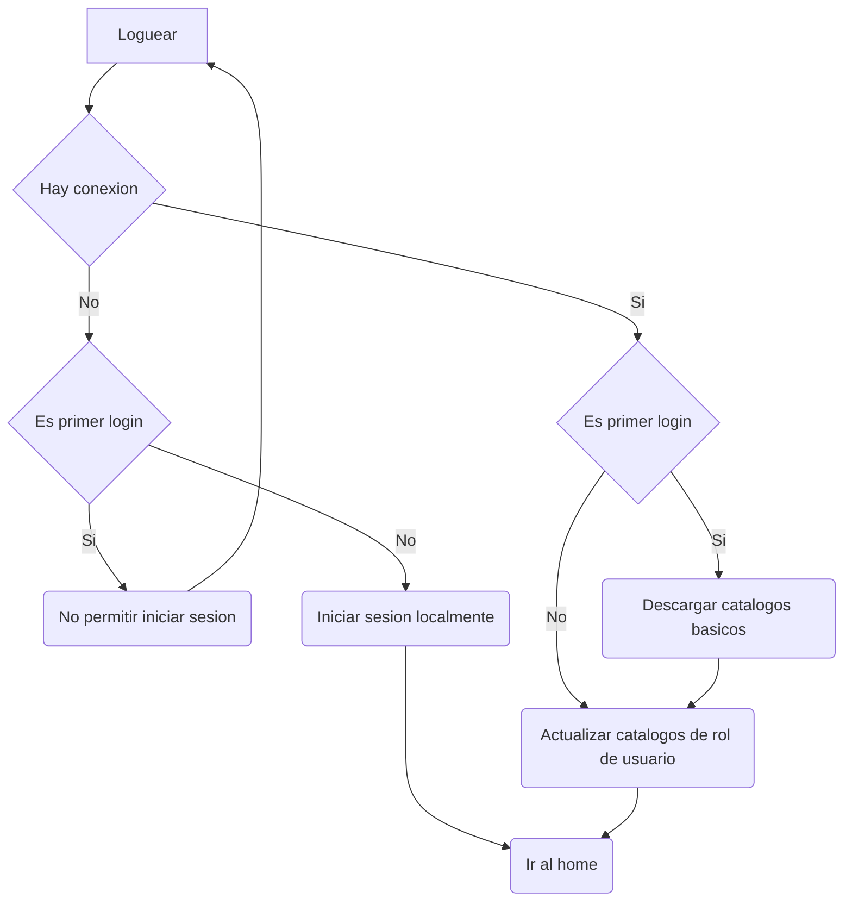
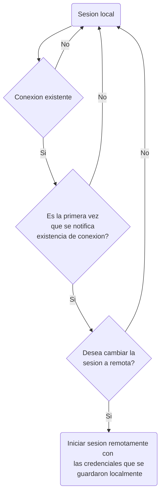
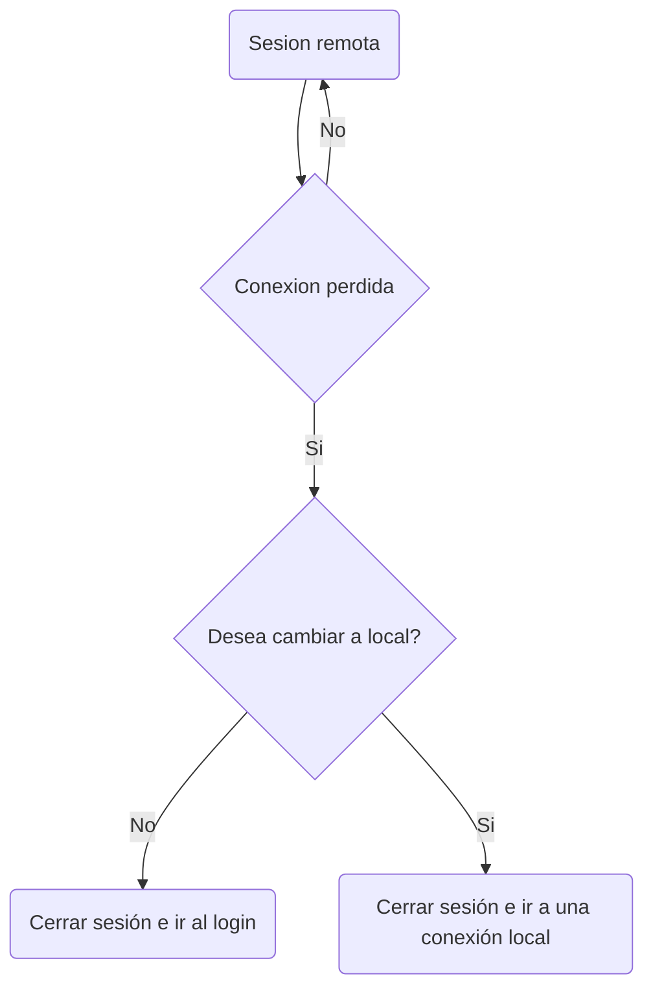

# Conectividad

## Inicio de sesión

```mermaid
    flowchart

    Loguear --> B{Hay conexion}
    B -- No --> C{Es primer login}
    C -- Si --> C1(No permitir iniciar sesion)
    C -- No --> C2(Iniciar sesion localmente)
    B -- Si --> D{Es primer login}
    D -- Si --> D1(Descargar catalogos basicos)
    D -- No --> D2(Actualizar catalogos de rol de usuario)
    D1 --> D2
    C1 --> Loguear
    C2 --> F(Ir al home)
    D2 --> F
```

## Conexión local a remota

```mermaid
    flowchart

    A(Sesion local) --> B{Conexion existente}
    B -- No --> A
    B -- Si --> C{Es la primera vez <br> que se notifica <br> existencia de conexion?}
    C -- No --> A
    C -- Si --> E{Desea cambiar la <br> sesion a remota?}
    E -- Si --> F(Iniciar sesion remotamente con <br> las credenciales que se <br> guardaron localmente)
    E -- No --> A

```

## Conexión remota a local

```mermaid
    flowchart

    A(Sesion remota) --> B{Conexion perdida}
    B -- No --> A
    B -- Si --> C{Desea cambiar a local?}
    C -- No --> G(Cerrar sesión e ir al login)
    C -- Si --> E(Cerrar sesión e ir a una conexión local)
```