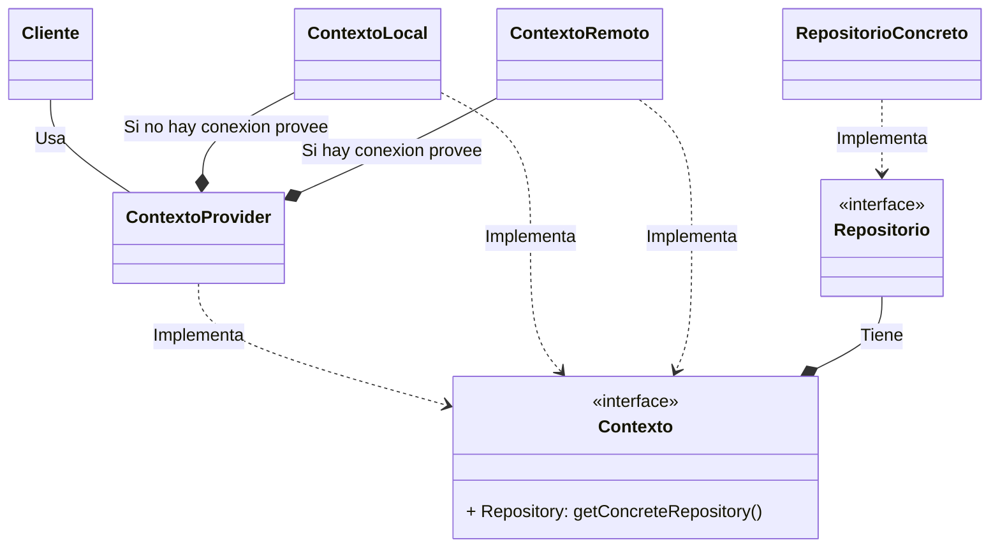

# Repositorios

A grandes rasgos la clase con la que vamos a estar utilizando para obtener información será la clase ContextoProvider, de tal forma que no sea una tarea tediosa saber que entorno debemos de utilizar dependiendo del estatus de conexion.

